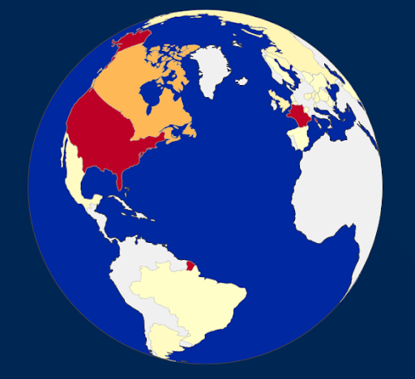
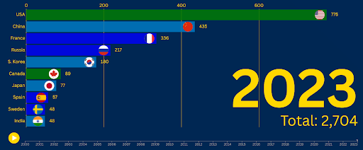
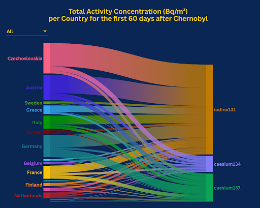
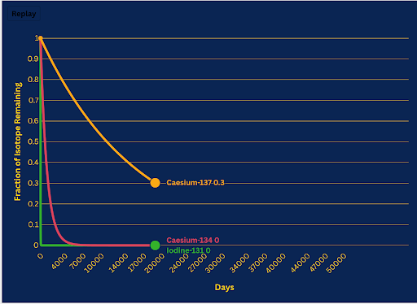
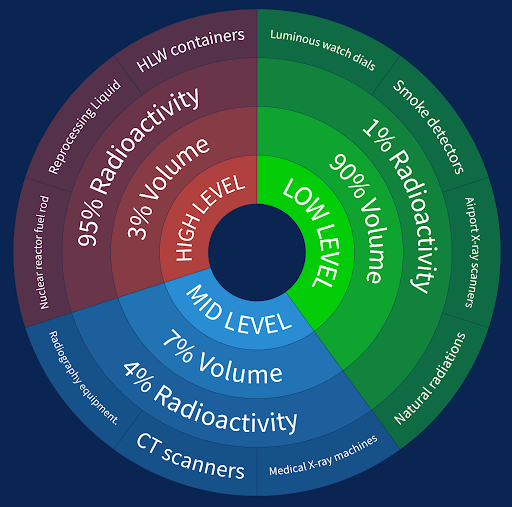

# SUPSI 2024-25  
**Data Visualization Course, M-D3202E**  
**Teacher:** Giovanni Profeta  

## Nuclear Energy Analysis  

### Authors  
- Alessio Carnevale  
- Manuel Cattoni  
- Carlo Schillaci  

---

## Abstract  
This project delves into the global evolution of nuclear energy generation from 2000 to 2023 through dynamic visualizations. Using a bar chart race format, it highlights key trends, shifts in leadership, and regional contributions, offering a comprehensive perspective on the role of nuclear energy in the global energy landscape. By focusing on historical data and production rankings, the study uncovers how nuclear power has shaped and adapted to global energy needs, policies, and technological progress.

---

## Introduction  
Nuclear energy has long been a cornerstone of electricity generation for many nations, offering a low-carbon alternative to fossil fuels. This project seeks to visualize the historical progression of nuclear electricity generation across the globe, focusing on trends, regional disparities, and the dynamic shifts in leadership among nuclear power producers. Through an animated bar chart race, the visualization illustrates how the global energy landscape has evolved over more than two decades, driven by advancements in nuclear technology, policy changes, and shifting energy demands.

This study aims to provide an accessible and engaging way to explore the data, helping policymakers, researchers, and energy professionals understand the pivotal role of nuclear energy in achieving energy security and sustainability.

---

## Data Sources  
The analysis is based on publicly available datasets tracking electricity generation from nuclear power plants. These datasets provide yearly production values for individual countries and are sourced from trusted organizations and repositories.  
**Main Data Sources:**  
- [International Atomic Energy Agency (IAEA)](https://www.iaea.org/)
- [World Nuclear Association](https://www.world-nuclear.org/)
- [Our World in Data: Energy Data](https://ourworldindata.org/energy)

### Data Pre-Processing  
The raw data underwent a rigorous pre-processing workflow to ensure accuracy and consistency:  
1. **Data Cleaning:** Country names were standardized, and units of measurement were unified.  
2. **Filtering:** Only data related to electricity generation from nuclear power plants was retained.  
3. **Interpolation:** Missing data points were filled using appropriate statistical methods.  
4. **Aggregation:** Yearly production totals were calculated for each country from 2000 to 2023.  

**Example Code Snippet for Pre-Processing:**  
```python
import pandas as pd

# Load dataset
df = pd.read_csv('nuclear_energy_data.csv')

# Clean and standardize data
df['Country'] = df['Country'].str.strip()
df = df[df['Energy_Source'] == 'Nuclear']

# Aggregate yearly production by country
yearly_data = df.groupby(['Year', 'Country'])['Electricity_Generated_TWh'].sum().reset_index()
```

---

## Data Visualizations  

The primary deliverable of this project is a set of visualizations designed to uncover trends and shifts in nuclear energy production. The centerpiece is an animated bar chart race, supplemented by complementary static charts.

### 1. Global Nuclear Energy Capacity  



### 2. Annual Nuclear Electricity Generation (Race Chart, 2000–2023)  
This animated bar chart race dynamically ranks countries based on their yearly nuclear electricity production, showcasing shifts in leadership and global trends.  
**Key Insights:**  
- The United States consistently led, averaging 775 TWh annually.  
- France held the second position until 2020, when China overtook it.  
- Europe dominated the top 10 throughout the 24 years, reflecting reliance on nuclear energy.  



---

### 3. Chernobyl and Nuclear Incidents  

#### Isotopes Concentration Post-Chernobyl  
The alluvial plot displays the total concentration of three radioactive isotopes (I-131, Cs-134, and Cs-137) across European countries for 60 days following the Chernobyl disaster.  



#### Isotopes Explanation  
The graph illustrates the decay curves of three radioactive isotopes—Iodine-131 (I-131), Caesium-134 (Cs-134), and Caesium-137 (Cs-137)—over a timeline of 50,000 days.  



#### Timeline of Nuclear Incidents  
A line chart reveals a clear timeline of nuclear incidents (1945–2015). The 1986 Chernobyl disaster and the 2011 Fukushima incident stand out as key events.  


---

### 4. Radioactive Waste Analysis  

#### Radioactive Waste Levels  
Nuclear waste is the byproduct of nuclear power generation, medical treatments, and other applications of nuclear technology. It varies significantly in its volume, contamination levels, and the intensity of its radioactivity. While low-level waste dominates in volume (90%), it contributes only a negligible amount of radioactivity (1%), highlighting its minimal hazard. On the other hand, high-level waste, though just 3% of the total volume, carries a staggering 95% of the radioactivity, underscoring the need for robust containment and long-term storage solutions. Intermediate-level waste, at 7% of the volume and 4% of radioactivity, bridges the gap between the two extremes, reflecting moderate contamination levels requiring careful handling.
Nuclear waste comes from activities like generating nuclear power, medical treatments, and other uses of nuclear technology. It’s not all the same—some waste takes up a lot of space but isn’t very dangerous, while other types are small in volume but extremely radioactive. Most of the waste, about 90%, is low-level, meaning it’s lightly contaminated and not too risky. On the flip side, high-level waste makes up only 3% of the total but holds a massive 95% of the radioactivity, making it the toughest to manage. In the middle, you’ve got intermediate-level waste, which is more contaminated than low-level but not as intense as high-level, accounting for 7% of the volume and 4% of the radioactivity



#### Coal vs. Nuclear Waste  
Nuclear waste is scary. But the fear of it reveals how bad we are at understanding risk. The largest amounts of radioactive elements like uranium and radon are actually released by coal, not nuclear energy. Burning millions of tons of coal each year leaves ashes as a waste product, which includes about 36,000 tons of radioactive materials globally. This material—comprised of uranium and thorium—is less radioactive than high-level nuclear waste, but there’s far more of it, and it is handled with far less care.


The average uranium and thorium content per kilogram of coal burnt in power plants is 5.1 milligrams. When multiplied by the approximately 7 billion tons of coal burned annually, this adds up to a total uranium and thorium content of 35,700 tons, rounded to 36,000 tons. (USGS; IEA) ([link1](https://www.iea.org/reports/coal-mid-year-update-july-2024/demand) ,
[link2](https://pubs.usgs.gov/fs/1997/fs163-97/FS-163-97.html?))

In contrast, nuclear power plants produce approximately 6,290 tons of high-level radioactive waste annually in the form of spent nuclear fuel. Nuclear waste is highly radioactive but tightly contained in pools, dry casks, or other secure facilities, minimizing its environmental impact. (IAEA) ([link1](https://www.iea.org/reports/coal-mid-year-update-july-2024/demand?) ,
[link2](https://www.iaea.org/newscenter/news/new-iaea-report-presents-global-overview-of-radioactive-waste-and-spent-fuel-management))

Meanwhile, coal ash, with its lower-level radioactive materials, is typically deposited in landfills or left in ash ponds, where it can leach into groundwater or become airborne. This lack of stringent management means that coal plants release far more radioactive material into the environment, exposing nearby populations to higher cumulative radiation doses than those near nuclear facilities.


---

## Key Findings  
- **Dynamic Leadership:** Clear dominance by a few nations, with shifts in rankings.  
- **Regional Disparities:** Asia's growth (e.g., China) contrasts with Europe's steady leadership.  
- **Global Trends:** Nuclear energy's role in transitioning to clean energy varies globally.  
- **Relative Safety:** Improved safety post-Chernobyl led to fewer severe incidents.  
- **Misinformation:** Misunderstanding risks associated with nuclear vs. coal waste persists.  

---

## Next Steps  
Future work could explore:  
1. **Projections:** Forecast nuclear electricity generation trends through 2050.  
2. **Policy Analysis:** Assess the impact of nuclear energy policies on production.  
3. **Environmental Context:** Highlight nuclear energy's contribution to reducing CO₂ emissions.  
4. **Energy Transition:** Compare nuclear trends with renewable energy sources.  

This project not only provides insights into nuclear energy's historical role but also lays the groundwork for exploring its future potential in addressing global energy challenges.
