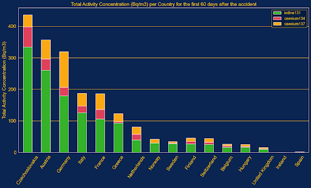

# SUPSI 2024-25  
**Data Visualization Course, M-D3202E**  
**Teacher:** Giovanni Profeta  

## Nuclear Energy Analysis  

### Authors  
- Alessio Carnevale  
- Manuel Cattoni  
- Carlo Schillaci  

---

## Abstract  
This project delves into the global evolution of nuclear energy generation from 2000 to 2023 through dynamic visualizations. Using a bar chart race format, it highlights key trends, shifts in leadership, and regional contributions, offering a comprehensive perspective on the role of nuclear energy in the global energy landscape. By focusing on historical data and production rankings, the study uncovers how nuclear power has shaped and adapted to global energy needs, policies, and technological progress.

---

## Introduction  
Nuclear energy has long been a cornerstone of electricity generation for many nations, offering a low-carbon alternative to fossil fuels. This project visualizes the historical progression of nuclear electricity generation worldwide, focusing on trends, regional disparities, and shifts in leadership among nuclear power producers.

Through an animated bar chart race, we illustrate how the global energy landscape has evolved over two decades, driven by advancements in nuclear technology, policy changes, and shifting energy demands. The study aims to provide an accessible and engaging way to explore the data, helping policymakers, researchers, and energy professionals understand the pivotal role of nuclear energy in achieving energy security and sustainability.

---

## Data Sources  
The analysis is based on publicly available datasets tracking electricity generation from nuclear power plants.  
**Main Data Sources:**  
- International Atomic Energy Agency (IAEA)  
- World Nuclear Association  
- Our World in Data: Energy Data  

### Data Pre-Processing  
The raw data underwent a rigorous pre-processing workflow:  
1. **Data Cleaning:** Standardized country names and measurement units.  
2. **Filtering:** Retained data related to electricity generation from nuclear power plants.  
3. **Interpolation:** Filled missing data points using statistical methods.  
4. **Aggregation:** Calculated yearly production totals for each country (2000–2023).  

**Example Code Snippet for Pre-Processing:**  
```python
import pandas as pd

# Load dataset
df = pd.read_csv('nuclear_energy_data.csv')

# Clean and standardize data
df['Country'] = df['Country'].str.strip()
df = df[df['Energy_Source'] == 'Nuclear']

# Aggregate yearly production by country
yearly_data = df.groupby(['Year', 'Country'])['Electricity_Generated_TWh'].sum().reset_index()
```

---

## Data Visualizations  

### 1. Global Nuclear Energy Capacity  


### 2. Annual Nuclear Electricity Generation (Race Chart, 2000–2023)  
This animated bar chart race dynamically ranks countries based on yearly nuclear electricity production, showcasing shifts in leadership and global trends.  
**Key Insights:**  
- The United States consistently led, averaging 775 TWh annually.  
- France held the second position until 2020, when China overtook it.  
- Europe dominated the top 10 throughout the 24 years, reflecting reliance on nuclear energy.  


---

### 3. Chernobyl and Nuclear Incidents  

#### Isotopes Concentration Post-Chernobyl  
The alluvial plot displays the concentration of three radioactive isotopes (I-131, Cs-134, and Cs-137) across European countries for 60 days following the Chernobyl disaster.  

#### Half-Life of Isotopes  
A decay curve illustrates the half-life of Iodine-131 (8 days), Caesium-134 (2 years), and Caesium-137 (30 years), showing their environmental impact.  

#### Timeline of Nuclear Incidents  
A line chart reveals a clear timeline of nuclear incidents (1945–2015). The 1986 Chernobyl disaster and the 2011 Fukushima incident stand out as key events.  



---

### 4. Radioactive Waste Analysis  

#### Radioactive Waste Levels  
- **Low-Level Waste:** 90% of volume, 1% of radioactivity.  
- **Intermediate-Level Waste:** 7% of volume, 4% of radioactivity.  
- **High-Level Waste:** 3% of volume, 95% of radioactivity.  

#### Coal vs. Nuclear Waste  
Coal plants release far more radioactive materials into the environment compared to nuclear power plants, despite the lower public perception of coal’s risks.


---

## Key Findings  
- **Dynamic Leadership:** Clear dominance by a few nations, with shifts in rankings.  
- **Regional Disparities:** Asia's growth (e.g., China) contrasts with Europe's steady leadership.  
- **Global Trends:** Nuclear energy's role in transitioning to clean energy varies globally.  
- **Relative Safety:** Improved safety post-Chernobyl led to fewer severe incidents.  
- **Misinformation:** Misunderstanding risks associated with nuclear vs. coal waste persists.  

---

## Next Steps  
Future work could explore:  
1. **Projections:** Forecast nuclear electricity generation trends through 2050.  
2. **Policy Analysis:** Assess the impact of nuclear energy policies on production.  
3. **Environmental Context:** Highlight nuclear energy's contribution to reducing CO₂ emissions.  
4. **Energy Transition:** Compare nuclear trends with renewable energy sources.  

This project not only provides insights into nuclear energy's historical role but also lays the groundwork for exploring its future potential in addressing global energy challenges.
